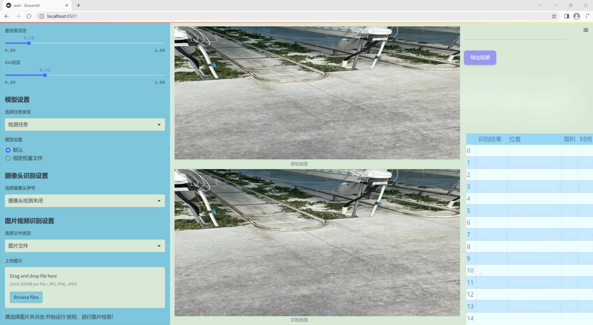

### 1.背景意义

研究背景与意义

随着城市化进程的加快，铁路运输在现代交通系统中扮演着越来越重要的角色。轨道图像的准确分析与处理不仅对铁路安全至关重要，还对提高运输效率、降低运营成本具有重要意义。传统的轨道检测方法往往依赖人工观察和经验判断，效率低下且容易受到人为因素的影响。因此，开发一种基于计算机视觉的自动化轨道图像分割系统显得尤为迫切。

在这一背景下，YOLO（You Only Look Once）系列模型因其高效的实时目标检测能力而受到广泛关注。YOLOv11作为该系列的最新版本，结合了深度学习和计算机视觉的最新进展，能够在复杂的环境中快速、准确地识别和分割目标物体。通过对YOLOv11进行改进，我们可以进一步提升其在轨道图像分割任务中的表现，使其更好地适应轨道场景的多样性和复杂性。

本研究将利用一个包含1800张图像的轨道数据集，该数据集涵盖了8个不同的类别，提供了丰富的训练样本。这些图像经过精确标注，能够为模型的训练提供坚实的基础。通过对数据集的深入分析与处理，我们期望能够提高模型的泛化能力，使其在实际应用中表现出色。此外，轨道图像分割系统的成功实施，将为铁路行业的智能化发展提供重要的技术支持，推动铁路安全监测和维护的自动化进程。

综上所述，基于改进YOLOv11的轨道图像分割系统不仅具有重要的学术研究价值，也为实际应用提供了切实可行的解决方案，具有广泛的社会和经济意义。

### 2.视频效果

[2.1 视频效果](https://www.bilibili.com/video/BV1E2qVYzEZW/)

### 3.图片效果





##### [项目涉及的源码数据来源链接](https://kdocs.cn/l/cszuIiCKVNis)**

注意：本项目提供训练的数据集和训练教程,由于版本持续更新,暂不提供权重文件（best.pt）,请按照6.训练教程进行训练后实现上图演示的效果。

### 4.数据集信息

##### 4.1 本项目数据集类别数＆类别名

nc: 8
names: ['0', '1', '2', '3', '4', '5', '6', '7']


该项目为【图像分割】数据集，请在【训练教程和Web端加载模型教程（第三步）】这一步的时候按照【图像分割】部分的教程来训练

##### 4.2 本项目数据集信息介绍

本项目数据集信息介绍

本项目所使用的数据集名为“rail_230821”，旨在为改进YOLOv11的轨道图像分割系统提供丰富的训练素材。该数据集包含8个类别，分别用数字0至7进行标识，涵盖了轨道图像中可能出现的多种元素。这些类别的设置不仅反映了轨道环境的复杂性，也为模型的训练提供了多样化的样本，使其能够更好地适应实际应用中的各种情况。

在数据集的构建过程中，研究团队对轨道图像进行了精细的标注，确保每个类别的特征能够被清晰地识别。类别0至7可能代表不同的轨道部件、信号设备、周边环境等元素，这些元素在轨道监测和维护中具有重要意义。通过对这些类别的准确标注，模型将能够学习到不同对象的形状、颜色及其在图像中的相对位置，从而提高分割的精度和鲁棒性。

数据集的多样性和丰富性为YOLOv11的训练提供了坚实的基础，能够有效提升模型在实际场景中的表现。通过使用“rail_230821”数据集，研究团队期望能够在轨道图像分割任务中实现更高的准确率和更快的处理速度，为轨道交通的安全与效率提供有力支持。此外，数据集的设计也考虑到了未来的扩展性，后续可以根据实际需求添加更多类别或样本，以进一步提升模型的适应能力和实用性。总之，“rail_230821”数据集的构建不仅为本项目的研究提供了必要的支持，也为轨道图像处理领域的相关研究奠定了基础。


### 5.全套项目环境部署视频教程（零基础手把手教学）

[5.1 所需软件PyCharm和Anaconda安装教程（第一步）](https://www.bilibili.com/video/BV1BoC1YCEKi/?spm_id_from=333.999.0.0&vd_source=bc9aec86d164b67a7004b996143742dc)


[5.2 安装Python虚拟环境创建和依赖库安装视频教程（第二步）](https://www.bilibili.com/video/BV1ZoC1YCEBw?spm_id_from=333.788.videopod.sections&vd_source=bc9aec86d164b67a7004b996143742dc)

### 6.改进YOLOv11训练教程和Web_UI前端加载模型教程（零基础手把手教学）

[6.1 改进YOLOv11训练教程和Web_UI前端加载模型教程（第三步）](https://www.bilibili.com/video/BV1BoC1YCEhR?spm_id_from=333.788.videopod.sections&vd_source=bc9aec86d164b67a7004b996143742dc)


按照上面的训练视频教程链接加载项目提供的数据集，运行train.py即可开始训练



     Epoch   gpu_mem       box       obj       cls    labels  img_size
     1/200     20.8G   0.01576   0.01955  0.007536        22      1280: 100%|██████████| 849/849 [14:42<00:00,  1.04s/it]
               Class     Images     Labels          P          R     mAP@.5 mAP@.5:.95: 100%|██████████| 213/213 [01:14<00:00,  2.87it/s]
                 all       3395      17314      0.994      0.957      0.0957      0.0843

     Epoch   gpu_mem       box       obj       cls    labels  img_size
     2/200     20.8G   0.01578   0.01923  0.007006        22      1280: 100%|██████████| 849/849 [14:44<00:00,  1.04s/it]
               Class     Images     Labels          P          R     mAP@.5 mAP@.5:.95: 100%|██████████| 213/213 [01:12<00:00,  2.95it/s]
                 all       3395      17314      0.996      0.956      0.0957      0.0845

     Epoch   gpu_mem       box       obj       cls    labels  img_size
     3/200     20.8G   0.01561    0.0191  0.006895        27      1280: 100%|██████████| 849/849 [10:56<00:00,  1.29it/s]
               Class     Images     Labels          P          R     mAP@.5 mAP@.5:.95: 100%|███████   | 187/213 [00:52<00:00,  4.04it/s]
                 all       3395      17314      0.996      0.957      0.0957      0.0845


###### [项目数据集下载链接](https://kdocs.cn/l/cszuIiCKVNis)

### 7.原始YOLOv11算法讲解

YOLOv11是Ultralytics推出的YOLO系列最新版本，专为实现尖端的物体检测而设计。其架构和训练方法上进行了重大改进，使之不仅具备卓越的准确性和处理速度，还在计算效率上实现了一场革命。得益于其改进的主干和颈部架构，YOLOv11在特征提取和处理复杂任务时表现更加出色。在2024年9月27日，Ultralytics通过长达九小时的在线直播发布这一新作，展示了其在计算机视觉领域的革新。

YOLOv11通过精细的架构设计和优化训练流程，在保持高精度的同时，缩减了参数量，与YOLOv8m相比减少了22%的参数，使其在COCO数据集上的平均准确度（mAP）有所提升。这种效率的提高使YOLOv11非常适合部署在各种硬件环境中，包括边缘设备、云计算平台以及支持NVIDIA GPU的系统，确保在灵活性上的优势。

该模型支持广泛的任务，从对象检测、实例分割到图像分类、姿态估计和定向对象检测（OBB），几乎覆盖了计算机视觉的所有主要挑战。其创新的C3k2和C2PSA模块提升了网络深度和注意力机制的应用，提高了特征提取的效率和效果。同时，YOLOv11的改进网络结构也使之在复杂视觉任务上得以从容应对，成为各类计算机视觉任务的多功能选择。这些特性令YOLOv11在实施实时物体检测的各个领域中表现出众。
* * *

2024年9月27日，Ultralytics在线直播长达九小时，为YOLO11召开“发布会”

YOLO11 是 Ultralytics YOLO 系列实时物体检测器的最新版本，它以尖端的准确性、速度和效率重新定义了可能性。在之前 YOLO
版本的显著进步的基础上，YOLO11 在架构和训练方法方面进行了重大改进，使其成为各种计算机视觉任务的多功能选择。


##### YOLO11主要特点：

  * 增强的特征提取：YOLO11 采用了改进的主干和颈部架构，增强了特征提取能力，可实现更精确的对象检测和复杂任务性能。
  * 针对效率和速度进行了优化：YOLO11 引入了完善的架构设计和优化的训练流程，可提供更快的处理速度，并在准确度和性能之间保持最佳平衡。
  * 更少的参数，更高的准确度：借助模型设计的进步，YOLO11m 在 COCO 数据集上实现了更高的平均准确度 (mAP)，同时使用的参数比 YOLOv8m 少 22%，从而提高了计算效率，同时又不影响准确度。
  * 跨环境的适应性：YOLO11 可以无缝部署在各种环境中，包括边缘设备、云平台和支持 NVIDIA GPU 的系统，从而确保最大的灵活性。
  * 支持的任务范围广泛：无论是对象检测、实例分割、图像分类、姿势估计还是定向对象检测 (OBB)，YOLO11 都旨在满足各种计算机视觉挑战。

##### 支持的任务和模式

YOLO11 以 YOLOv8 中引入的多功能模型系列为基础，为各种计算机视觉任务提供增强的支持：

Model| Filenames| Task| Inference| Validation| Training| Export  
---|---|---|---|---|---|---  
YOLO11| yolol11n.pt, yolol11s.pt, yolol11m.pt, yolol11x.pt| Detection| ✅| ✅|
✅| ✅  
YOLO11-seg| yolol11n-seg.pt, yolol11s-seg.pt, yolol11m-seg.pt,
yolol11x-seg.pt| Instance Segmentation| ✅| ✅| ✅| ✅  
YOLO11-pose| yolol11n-pose.pt, yolol11s-pose.pt, yolol11m-pose.pt,
yolol11x-pose.pt| Pose/Keypoints| ✅| ✅| ✅| ✅  
YOLO11-obb| yolol11n-obb.pt, yolol11s-obb.pt, yolol11m-obb.pt,
yolol11x-obb.pt| Oriented Detection| ✅| ✅| ✅| ✅  
YOLO11-cls| yolol11n-cls.pt, yolol11s-cls.pt, yolol11m-cls.pt,
yolol11x-cls.pt| Classification| ✅| ✅| ✅| ✅  
  
##### 简单的 YOLO11 训练和推理示例

以下示例适用于用于对象检测的 YOLO11 Detect 模型。

    
    
    from ultralytics import YOLO
    
    # Load a model
    model = YOLO("yolo11n.pt")
    
    # Train the model
    train_results = model.train(
        data="coco8.yaml",  # path to dataset YAML
        epochs=100,  # number of training epochs
        imgsz=640,  # training image size
        device="cpu",  # device to run on, i.e. device=0 or device=0,1,2,3 or device=cpu
    )
    
    # Evaluate model performance on the validation set
    metrics = model.val()
    
    # Perform object detection on an image
    results = model("path/to/image.jpg")
    results[0].show()
    
    # Export the model to ONNX format
    path = model.export(format="onnx")  # return path to exported model

##### 支持部署于边缘设备

YOLO11 专为适应各种环境而设计，包括边缘设备。其优化的架构和高效的处理能力使其适合部署在边缘设备、云平台和支持 NVIDIA GPU
的系统上。这种灵活性确保 YOLO11 可用于各种应用，从移动设备上的实时检测到云环境中的复杂分割任务。有关部署选项的更多详细信息，请参阅导出文档。

##### YOLOv11 yaml文件

    
    
    # Ultralytics YOLO 🚀, AGPL-3.0 license
    # YOLO11 object detection model with P3-P5 outputs. For Usage examples see https://docs.ultralytics.com/tasks/detect
    
    # Parameters
    nc: 80 # number of classes
    scales: # model compound scaling constants, i.e. 'model=yolo11n.yaml' will call yolo11.yaml with scale 'n'
      # [depth, width, max_channels]
      n: [0.50, 0.25, 1024] # summary: 319 layers, 2624080 parameters, 2624064 gradients, 6.6 GFLOPs
      s: [0.50, 0.50, 1024] # summary: 319 layers, 9458752 parameters, 9458736 gradients, 21.7 GFLOPs
      m: [0.50, 1.00, 512] # summary: 409 layers, 20114688 parameters, 20114672 gradients, 68.5 GFLOPs
      l: [1.00, 1.00, 512] # summary: 631 layers, 25372160 parameters, 25372144 gradients, 87.6 GFLOPs
      x: [1.00, 1.50, 512] # summary: 631 layers, 56966176 parameters, 56966160 gradients, 196.0 GFLOPs
    
    # YOLO11n backbone
    backbone:
      # [from, repeats, module, args]
      - [-1, 1, Conv, [64, 3, 2]] # 0-P1/2
      - [-1, 1, Conv, [128, 3, 2]] # 1-P2/4
      - [-1, 2, C3k2, [256, False, 0.25]]
      - [-1, 1, Conv, [256, 3, 2]] # 3-P3/8
      - [-1, 2, C3k2, [512, False, 0.25]]
      - [-1, 1, Conv, [512, 3, 2]] # 5-P4/16
      - [-1, 2, C3k2, [512, True]]
      - [-1, 1, Conv, [1024, 3, 2]] # 7-P5/32
      - [-1, 2, C3k2, [1024, True]]
      - [-1, 1, SPPF, [1024, 5]] # 9
      - [-1, 2, C2PSA, [1024]] # 10
    
    # YOLO11n head
    head:
      - [-1, 1, nn.Upsample, [None, 2, "nearest"]]
      - [[-1, 6], 1, Concat, [1]] # cat backbone P4
      - [-1, 2, C3k2, [512, False]] # 13
    
      - [-1, 1, nn.Upsample, [None, 2, "nearest"]]
      - [[-1, 4], 1, Concat, [1]] # cat backbone P3
      - [-1, 2, C3k2, [256, False]] # 16 (P3/8-small)
    
      - [-1, 1, Conv, [256, 3, 2]]
      - [[-1, 13], 1, Concat, [1]] # cat head P4
      - [-1, 2, C3k2, [512, False]] # 19 (P4/16-medium)
    
      - [-1, 1, Conv, [512, 3, 2]]
      - [[-1, 10], 1, Concat, [1]] # cat head P5
      - [-1, 2, C3k2, [1024, True]] # 22 (P5/32-large)
    
      - [[16, 19, 22], 1, Detect, [nc]] # Detect(P3, P4, P5)
    

**YOLO11和YOLOv8 yaml文件的区别**


##### 改进模块代码

  * C3k2 

    
    
    class C3k2(C2f):
        """Faster Implementation of CSP Bottleneck with 2 convolutions."""
    
        def __init__(self, c1, c2, n=1, c3k=False, e=0.5, g=1, shortcut=True):
            """Initializes the C3k2 module, a faster CSP Bottleneck with 2 convolutions and optional C3k blocks."""
            super().__init__(c1, c2, n, shortcut, g, e)
            self.m = nn.ModuleList(
                C3k(self.c, self.c, 2, shortcut, g) if c3k else Bottleneck(self.c, self.c, shortcut, g) for _ in range(n)
            )

C3k2，它是具有两个卷积的CSP（Partial Cross Stage）瓶颈架构的更快实现。

**类继承：**

  * `C3k2`继承自类`C2f`。这表明`C2f`很可能实现了经过修改的基本CSP结构，而`C3k2`进一步优化或修改了此结构。

**构造函数（`__init__`）：**

  * `c1`：输入通道。

  * `c2`：输出通道。

  * `n`：瓶颈层数（默认为1）。

  * `c3k`：一个布尔标志，确定是否使用`C3k`块或常规`Bottleneck`块。

  * `e`：扩展比率，控制隐藏层的宽度（默认为0.5）。

  * `g`：分组卷积的组归一化参数或组数（默认值为 1）。

  * `shortcut`：一个布尔值，用于确定是否在网络中包含快捷方式连接（默认值为 `True`）。

**初始化：**

  * `super().__init__(c1, c2, n, short-cut, g, e)` 调用父类 `C2f` 的构造函数，初始化标准 CSP 组件，如通道数、快捷方式、组等。

**模块列表（`self.m`）：**

  * `nn.ModuleList` 存储 `C3k` 或 `Bottleneck` 模块，具体取决于 `c3k` 的值。

  * 如果 `c3k` 为 `True`，它会初始化 `C3k` 模块。`C3k` 模块接收以下参数：

  * `self.c`：通道数（源自 `C2f`）。

  * `2`：这表示在 `C3k` 块内使用了两个卷积层。

  * `shortcut` 和 `g`：从 `C3k2` 构造函数传递。

  * 如果 `c3k` 为 `False`，则初始化标准 `Bottleneck` 模块。

`for _ in range(n)` 表示将创建 `n` 个这样的块。

**总结：**

  * `C3k2` 实现了 CSP 瓶颈架构，可以选择使用自定义 `C3k` 块（具有两个卷积）或标准 `Bottleneck` 块，具体取决于 `c3k` 标志。

  * C2PSA

    
    
    class C2PSA(nn.Module):
        """
        C2PSA module with attention mechanism for enhanced feature extraction and processing.
    
        This module implements a convolutional block with attention mechanisms to enhance feature extraction and processing
        capabilities. It includes a series of PSABlock modules for self-attention and feed-forward operations.
    
        Attributes:
            c (int): Number of hidden channels.
            cv1 (Conv): 1x1 convolution layer to reduce the number of input channels to 2*c.
            cv2 (Conv): 1x1 convolution layer to reduce the number of output channels to c.
            m (nn.Sequential): Sequential container of PSABlock modules for attention and feed-forward operations.
    
        Methods:
            forward: Performs a forward pass through the C2PSA module, applying attention and feed-forward operations.
    
        Notes:
            This module essentially is the same as PSA module, but refactored to allow stacking more PSABlock modules.
    
        Examples:
            >>> c2psa = C2PSA(c1=256, c2=256, n=3, e=0.5)
            >>> input_tensor = torch.randn(1, 256, 64, 64)
            >>> output_tensor = c2psa(input_tensor)
        """
    
        def __init__(self, c1, c2, n=1, e=0.5):
            """Initializes the C2PSA module with specified input/output channels, number of layers, and expansion ratio."""
            super().__init__()
            assert c1 == c2
            self.c = int(c1 * e)
            self.cv1 = Conv(c1, 2 * self.c, 1, 1)
            self.cv2 = Conv(2 * self.c, c1, 1)
    
            self.m = nn.Sequential(*(PSABlock(self.c, attn_ratio=0.5, num_heads=self.c // 64) for _ in range(n)))
    
        def forward(self, x):
            """Processes the input tensor 'x' through a series of PSA blocks and returns the transformed tensor."""
            a, b = self.cv1(x).split((self.c, self.c), dim=1)
            b = self.m(b)
            return self.cv2(torch.cat((a, b), 1))

`C2PSA` 模块是一个自定义神经网络层，带有注意力机制，用于增强特征提取和处理。

**类概述**

  * **目的：**

  * `C2PSA` 模块引入了一个卷积块，利用注意力机制来改进特征提取和处理。

  * 它使用一系列 `PSABlock` 模块，这些模块可能代表某种形式的位置自注意力 (PSA)，并且该架构旨在允许堆叠多个 `PSABlock` 层。

**构造函数（`__init__`）：**

  * **参数：**

  * `c1`：输入通道（必须等于 `c2`）。

  * `c2`：输出通道（必须等于 `c1`）。

  * `n`：要堆叠的 `PSABlock` 模块数量（默认值为 1）。

  * `e`：扩展比率，用于计算隐藏通道的数量（默认值为 0.5）。

  * **属性：**

  * `self.c`：隐藏通道数，计算为 `int(c1 * e)`。

  * `self.cv1`：一个 `1x1` 卷积，将输入通道数从 `c1` 减少到 `2 * self.c`。这为将输入分成两部分做好准备。

  * `self.cv2`：另一个 `1x1` 卷积，处理后将通道维度恢复回 `c1`。

  * `self.m`：一系列 `PSABlock` 模块。每个 `PSABlock` 接收 `self.c` 通道，注意头的数量为 `self.c // 64`。每个块应用注意和前馈操作。

**前向方法：**

  * **输入：**

  * `x`，输入张量。

  * **操作：**

  1. `self.cv1(x)` 应用 `1x1` 卷积，将输入通道大小从 `c1` 减小到 `2 * self.c`。

  2. 生成的张量沿通道维度分为两部分，`a` 和 `b`。

  * `a`：第一个 `self.c` 通道。

  * `b`：剩余的 `self.c` 通道。

  1. `b` 通过顺序容器 `self.m`，它是 `PSABlock` 模块的堆栈。这部分经过基于注意的处理。

  2. 处理后的张量 `b` 与 `a` 连接。

  3. `self.cv2` 应用 `1x1` 卷积，将通道大小恢复为 `c1`。

  * **输出：**

  * 应用注意和卷积操作后的变换后的张量。

**总结：**

  * **C2PSA** 是一个增强型卷积模块，它通过堆叠的 `PSABlock` 模块应用位置自注意力。它拆分输入张量，将注意力应用于其中一部分，然后重新组合并通过最终卷积对其进行处理。此结构有助于从输入数据中提取复杂特征。

##### 网络结构


### 8.200+种全套改进YOLOV11创新点原理讲解

#### 8.1 200+种全套改进YOLOV11创新点原理讲解大全

由于篇幅限制，每个创新点的具体原理讲解就不全部展开，具体见下列网址中的改进模块对应项目的技术原理博客网址【Blog】（创新点均为模块化搭建，原理适配YOLOv5~YOLOv11等各种版本）

[改进模块技术原理博客【Blog】网址链接](https://gitee.com/qunmasj/good)


#### 8.2 精选部分改进YOLOV11创新点原理讲解

###### 这里节选部分改进创新点展开原理讲解(完整的改进原理见上图和[改进模块技术原理博客链接](https://gitee.com/qunmasj/good)【如果此小节的图加载失败可以通过CSDN或者Github搜索该博客的标题访问原始博客，原始博客图片显示正常】

### MS-Block简介
实时目标检测，以YOLO系列为例，已在工业领域中找到重要应用，特别是在边缘设备（如无人机和机器人）中。与之前的目标检测器不同，实时目标检测器旨在在速度和准确性之间追求最佳平衡。为了实现这一目标，提出了大量的工作：从第一代DarkNet到CSPNet，再到最近的扩展ELAN，随着性能的快速增长，实时目标检测器的架构经历了巨大的变化。

尽管性能令人印象深刻，但在不同尺度上识别对象仍然是实时目标检测器面临的基本挑战。这促使作者设计了一个强大的编码器架构，用于学习具有表现力的多尺度特征表示。具体而言，作者从两个新的角度考虑为实时目标检测编码多尺度特征：

从局部视角出发，作者设计了一个具有简单而有效的分层特征融合策略的MS-Block。受到Res2Net的启发，作者在MS-Block中引入了多个分支来进行特征提取，但不同的是，作者使用了一个带有深度卷积的 Inverted Bottleneck Block块，以实现对大Kernel的高效利用。

从全局视角出发，作者提出随着网络加深逐渐增加卷积的Kernel-Size。作者在浅层使用小Kernel卷积来更高效地处理高分辨率特征。另一方面，在深层中，作者采用大Kernel卷积来捕捉广泛的信息。

基于以上设计原则，作者呈现了作者的实时目标检测器，称为YOLO-MS。为了评估作者的YOLO-MS的性能，作者在MS COCO数据集上进行了全面的实验。还提供了与其他最先进方法的定量比较，以展示作者方法的强大性能。如图1所示，YOLO-MS在计算性能平衡方面优于其他近期的实时目标检测器。


具体而言，YOLO-MS-XS在MS COCO上获得了43%+的AP得分，仅具有450万个可学习参数和8.7亿个FLOPs。YOLO-MS-S和YOLO-MS分别获得了46%+和51%+的AP，可学习参数分别为810万和2220万。此外，作者的工作还可以作为其他YOLO模型的即插即用模块。通常情况下，作者的方法可以将YOLOv11的AP从37%+显著提高到40%+，甚至还可以使用更少的参数和FLOPs。

CSP Block是一个基于阶段级梯度路径的网络，平衡了梯度组合和计算成本。它是广泛应用于YOLO系列的基本构建块。已经提出了几种变体，包括YOLOv4和YOLOv11中的原始版本，Scaled YOLOv4中的CSPVoVNet，YOLOv11中的ELAN，以及RTMDet中提出的大Kernel单元。作者在图2(a)和图2(b)中分别展示了原始CSP块和ELAN的结构。


上述实时检测器中被忽视的一个关键方面是如何在基本构建块中编码多尺度特征。其中一个强大的设计原则是Res2Net，它聚合了来自不同层次的特征以增强多尺度表示。然而，这一原则并没有充分探索大Kernel卷积的作用，而大Kernel卷积已经在基于CNN的视觉识别任务模型中证明有效。将大Kernel卷积纳入Res2Net的主要障碍在于它们引入的计算开销，因为构建块采用了标准卷积。在作者的方法中，作者提出用 Inverted Bottleneck Block替代标准的3 × 3卷积，以享受大Kernel卷积的好处。

#### MS-Block

基于前面的分析，参考该博客提出了一个带有分层特征融合策略的全新Block，称为MS-Block，以增强实时目标检测器在提取多尺度特征时的能力，同时保持快速的推理速度。

MS-Block的具体结构如图2(c)所示。假设是输入特征。通过1×1卷积的转换后，X的通道维度增加到n*C。然后，作者将X分割成n个不同的组，表示为，其中。为了降低计算成本，作者选择n为3。

注意，除了之外，每个其他组都经过一个 Inverted Bottleneck Block层，用表示，其中k表示Kernel-Size，以获得。的数学表示如下：


根据这个公式，作者不将 Inverted Bottleneck Block层连接到，使其作为跨阶段连接，并保留来自前面层的信息。最后，作者将所有分割连接在一起，并应用1×1卷积来在所有分割之间进行交互，每个分割都编码不同尺度的特征。当网络加深时，这个1×1卷积也用于调整通道数。

#### Heterogeneous Kernel Selection Protocol
除了构建块的设计外，作者还从宏观角度探讨了卷积的使用。之前的实时目标检测器在不同的编码器阶段采用了同质卷积（即具有相同Kernel-Size的卷积），但作者认为这不是提取多尺度语义信息的最佳选项。

在金字塔结构中，从检测器的浅阶段提取的高分辨率特征通常用于捕捉细粒度语义，将用于检测小目标。相反，来自网络较深阶段的低分辨率特征用于捕捉高级语义，将用于检测大目标。如果作者在所有阶段都采用统一的小Kernel卷积，深阶段的有效感受野（ERF）将受到限制，影响大目标的性能。在每个阶段中引入大Kernel卷积可以帮助解决这个问题。然而，具有大的ERF的大Kernel可以编码更广泛的区域，这增加了在小目标外部包含噪声信息的概率，并且降低了推理速度。

在这项工作中，作者建议在不同阶段中采用异构卷积，以帮助捕获更丰富的多尺度特征。具体来说，在编码器的第一个阶段中，作者采用最小Kernel卷积，而最大Kernel卷积位于最后一个阶段。随后，作者逐步增加中间阶段的Kernel-Size，使其与特征分辨率的增加保持一致。这种策略允许提取细粒度和粗粒度的语义信息，增强了编码器的多尺度特征表示能力。

正如图所示，作者将k的值分别分配给编码器中的浅阶段到深阶段，取值为3、5、7和9。作者将其称为异构Kernel选择（HKS）协议。


作者的HKS协议能够在深层中扩大感受野，而不会对浅层产生任何其他影响。第4节的图4支持了作者的分析。此外，HKS不仅有助于编码更丰富的多尺度特征，还确保了高效的推理。

如表1所示，将大Kernel卷积应用于高分辨率特征会产生较高的计算开销。然而，作者的HKS协议在低分辨率特征上采用大Kernel卷积，从而与仅使用大Kernel卷积相比，大大降低了计算成本。


在实践中，作者经验性地发现，采用HKS协议的YOLO-MS的推理速度几乎与仅使用深度可分离的3 × 3卷积相同。


如图所示，作者模型的Backbone由4个阶段组成，每个阶段后面跟随1个步长为2的3 × 3卷积进行下采样。在第3个阶段后，作者添加了1个SPP块，与RTMDet中一样。在作者的编码器上，作者使用PAFPN作为Neck来构建特征金字塔[31, 35]。它融合了从Backbone不同阶段提取的多尺度特征。Neck中使用的基本构建块也是作者的MS-Block，在其中使用3 × 3深度可分离卷积进行快速推理。

此外，为了在速度和准确性之间取得更好的平衡，作者将Backbone中多级特征的通道深度减半。作者提供了3个不同尺度的YOLO-MS变体，即YOLO-MS-XS、YOLO-MS-S和YOLO-MS。不同尺度的YOLO-MS的详细配置列在表2中。对于YOLO-MS的其他部分，作者将其保持与RTMDet相同。


### 9.系统功能展示

图9.1.系统支持检测结果表格显示

  图9.2.系统支持置信度和IOU阈值手动调节

  图9.3.系统支持自定义加载权重文件best.pt(需要你通过步骤5中训练获得)

  图9.4.系统支持摄像头实时识别

  图9.5.系统支持图片识别

  图9.6.系统支持视频识别

  图9.7.系统支持识别结果文件自动保存

  图9.8.系统支持Excel导出检测结果数据


### 10. YOLOv11核心改进源码讲解

#### 10.1 UniRepLKNet.py

以下是对给定代码的核心部分进行分析和注释的结果。我们将保留主要的类和函数，并添加详细的中文注释，以便更好地理解其功能和实现。

```python
import torch
import torch.nn as nn
import torch.nn.functional as F
from timm.layers import trunc_normal_, DropPath, to_2tuple

# 定义全局变量，包含不同版本的 UniRepLKNet 模型
__all__ = ['unireplknet_a', 'unireplknet_f', 'unireplknet_p', 'unireplknet_n', 'unireplknet_t', 'unireplknet_s', 'unireplknet_b', 'unireplknet_l', 'unireplknet_xl']

class GRNwithNHWC(nn.Module):
    """ GRN (Global Response Normalization) 层
    此实现比原始版本更高效，假设输入格式为 (N, H, W, C)
    """
    def __init__(self, dim, use_bias=True):
        super().__init__()
        self.use_bias = use_bias
        self.gamma = nn.Parameter(torch.zeros(1, 1, 1, dim))  # 可学习参数 gamma
        if self.use_bias:
            self.beta = nn.Parameter(torch.zeros(1, 1, 1, dim))  # 可学习参数 beta

    def forward(self, x):
        Gx = torch.norm(x, p=2, dim=(1, 2), keepdim=True)  # 计算 L2 范数
        Nx = Gx / (Gx.mean(dim=-1, keepdim=True) + 1e-6)  # 归一化
        if self.use_bias:
            return (self.gamma * Nx + 1) * x + self.beta  # 应用归一化和偏置
        else:
            return (self.gamma * Nx + 1) * x  # 应用归一化

class SEBlock(nn.Module):
    """ Squeeze-and-Excitation Block
    该模块用于增强特征通道的表达能力
    """
    def __init__(self, input_channels, internal_neurons):
        super(SEBlock, self).__init__()
        self.down = nn.Conv2d(in_channels=input_channels, out_channels=internal_neurons, kernel_size=1, stride=1, bias=True)
        self.up = nn.Conv2d(in_channels=internal_neurons, out_channels=input_channels, kernel_size=1, stride=1, bias=True)
        self.input_channels = input_channels
        self.nonlinear = nn.ReLU(inplace=True)  # 使用 ReLU 激活函数

    def forward(self, inputs):
        x = F.adaptive_avg_pool2d(inputs, output_size=(1, 1))  # 全局平均池化
        x = self.down(x)  # 下采样
        x = self.nonlinear(x)  # 激活
        x = self.up(x)  # 上采样
        x = F.sigmoid(x)  # Sigmoid 激活
        return inputs * x.view(-1, self.input_channels, 1, 1)  # 按通道加权输入

class UniRepLKNetBlock(nn.Module):
    """ UniRepLKNet 的基本构建块
    该模块包含深度卷积、归一化、Squeeze-and-Excitation 和前馈网络
    """
    def __init__(self, dim, kernel_size, drop_path=0., layer_scale_init_value=1e-6, deploy=False, attempt_use_lk_impl=True, use_sync_bn=False, ffn_factor=4):
        super().__init__()
        self.dwconv = nn.Conv2d(dim, dim, kernel_size=kernel_size, stride=1, padding=kernel_size // 2, groups=dim, bias=True)  # 深度卷积
        self.norm = nn.BatchNorm2d(dim) if not deploy else nn.Identity()  # 归一化层
        self.se = SEBlock(dim, dim // 4)  # Squeeze-and-Excitation 模块

        ffn_dim = int(ffn_factor * dim)  # 前馈网络的维度
        self.pwconv1 = nn.Linear(dim, ffn_dim)  # 第一层前馈网络
        self.act = nn.GELU()  # GELU 激活函数
        self.pwconv2 = nn.Linear(ffn_dim, dim)  # 第二层前馈网络

        self.gamma = nn.Parameter(layer_scale_init_value * torch.ones(dim), requires_grad=True) if (not deploy) and layer_scale_init_value is not None and layer_scale_init_value > 0 else None
        self.drop_path = DropPath(drop_path) if drop_path > 0. else nn.Identity()  # 随机深度

    def forward(self, inputs):
        y = self.se(self.norm(self.dwconv(inputs)))  # 经过深度卷积、归一化和 SE 模块
        y = self.pwconv2(self.act(self.pwconv1(y)))  # 前馈网络
        if self.gamma is not None:
            y = self.gamma.view(1, -1, 1, 1) * y  # 应用 gamma
        return self.drop_path(y) + inputs  # 残差连接

class UniRepLKNet(nn.Module):
    """ UniRepLKNet 模型
    包含多个 UniRepLKNetBlock 以构建深度网络
    """
    def __init__(self, in_chans=3, num_classes=1000, depths=(3, 3, 27, 3), dims=(96, 192, 384, 768), drop_path_rate=0., layer_scale_init_value=1e-6, deploy=False, attempt_use_lk_impl=True, use_sync_bn=False):
        super().__init__()
        self.downsample_layers = nn.ModuleList()  # 下采样层
        self.stages = nn.ModuleList()  # 各个阶段的模块

        # 构建下采样层
        self.downsample_layers.append(nn.Conv2d(in_chans, dims[0] // 2, kernel_size=3, stride=2, padding=1))
        for i in range(3):
            self.downsample_layers.append(nn.Conv2d(dims[i], dims[i + 1], kernel_size=3, stride=2, padding=1))

        # 构建各个阶段的 UniRepLKNetBlock
        cur = 0
        for i in range(4):
            main_stage = nn.Sequential(
                *[UniRepLKNetBlock(dim=dims[i], kernel_size=3, drop_path=drop_path_rate) for j in range(depths[i])]
            )
            self.stages.append(main_stage)
            cur += depths[i]

    def forward(self, x):
        for stage_idx in range(4):
            x = self.downsample_layers[stage_idx](x)  # 下采样
            x = self.stages[stage_idx](x)  # 经过当前阶段的模块
        return x  # 返回最终特征

# 定义模型的不同版本
def unireplknet_a(weights='', **kwargs):
    model = UniRepLKNet(depths=(2, 2, 6, 2), dims=(40, 80, 160, 320), **kwargs)
    if weights:
        model.load_state_dict(torch.load(weights))  # 加载权重
    return model

# 主程序入口
if __name__ == '__main__':
    inputs = torch.randn((1, 3, 640, 640))  # 随机输入
    model = unireplknet_a()  # 创建模型
    res = model(inputs)  # 前向传播
    print(res.shape)  # 输出结果的形状
```

### 主要部分解释：
1. **GRNwithNHWC**: 实现了全局响应归一化层，能够根据输入的 L2 范数进行归一化。
2. **SEBlock**: Squeeze-and-Excitation 模块，通过全局平均池化和两次卷积来增强特征通道的表达能力。
3. **UniRepLKNetBlock**: UniRepLKNet 的基本构建块，包含深度卷积、归一化、Squeeze-and-Excitation 和前馈网络。
4. **UniRepLKNet**: 整个模型的实现，包含多个 UniRepLKNetBlock 以构建深度网络，并支持下采样。

以上是对核心代码的简化和注释，便于理解其结构和功能。

该文件实现了一个名为UniRepLKNet的深度学习模型，主要用于音频、视频、点云、时间序列和图像识别。该模型基于多个先进的网络架构，如RepLKNet、ConvNeXt、DINO和DeiT，并使用PyTorch框架进行构建。

文件首先导入了必要的库，包括PyTorch的核心模块和一些特定的层（如BatchNorm、DropPath等）。接着定义了一些辅助类和函数，例如GRNwithNHWC（全局响应归一化层）、NCHWtoNHWC和NHWCtoNCHW（用于不同数据格式之间的转换），以及用于选择卷积实现的get_conv2d函数。

GRN（全局响应归一化）层用于调整输入特征的响应，以增强模型的表达能力。NCHWtoNHWC和NHWCtoNCHW类则用于在不同的通道格式之间转换，以适应不同的卷积操作。get_conv2d函数根据输入参数决定使用标准卷积还是高效的iGEMM实现。

接下来，文件定义了Squeeze-and-Excitation（SE）块，这是一种用于提升网络性能的模块，通过自适应地重新调整通道的权重来增强特征表达。fuse_bn函数用于将卷积层和批归一化层合并，以减少模型推理时的计算开销。

DilatedReparamBlock类实现了稀疏卷积的重参数化，允许模型在推理时使用更高效的卷积结构。UniRepLKNetBlock类则是UniRepLKNet的基本构建块，包含了卷积、归一化、SE块和前馈网络。

UniRepLKNet类是整个模型的主体，包含了多个阶段的下采样层和对应的UniRepLKNetBlock。模型的构造函数接收多个参数，如输入通道数、类别数、每个阶段的深度和特征维度等，并根据这些参数构建网络结构。

在forward方法中，模型根据设定的输出模式（特征或分类结果）进行前向传播。最后，文件还定义了一些用于创建不同规模的UniRepLKNet模型的函数（如unireplknet_a、unireplknet_f等），并在主程序中展示了如何实例化模型并进行推理。

总体而言，该文件实现了一个灵活且高效的深度学习模型，能够适应多种输入类型，并通过多种技术手段提升模型的性能和推理效率。

#### 10.2 activation.py

```python
import torch
import torch.nn as nn

class AGLU(nn.Module):
    """统一激活函数模块，来源于 https://github.com/kostas1515/AGLU。"""

    def __init__(self, device=None, dtype=None) -> None:
        """初始化统一激活函数模块。"""
        super().__init__()
        # 使用Softplus作为基础激活函数，beta设置为-1.0
        self.act = nn.Softplus(beta=-1.0)
        # 初始化lambda参数，并将其定义为可学习的参数
        self.lambd = nn.Parameter(nn.init.uniform_(torch.empty(1, device=device, dtype=dtype)))  # lambda参数
        # 初始化kappa参数，并将其定义为可学习的参数
        self.kappa = nn.Parameter(nn.init.uniform_(torch.empty(1, device=device, dtype=dtype)))  # kappa参数

    def forward(self, x: torch.Tensor) -> torch.Tensor:
        """计算统一激活函数的前向传播。"""
        # 将lambda参数限制在最小值0.0001，以避免除以零的情况
        lam = torch.clamp(self.lambd, min=0.0001)
        # 计算激活值，使用kappa和lambda参数进行变换
        return torch.exp((1 / lam) * self.act((self.kappa * x) - torch.log(lam)))
```

### 代码核心部分及注释说明：
1. **类定义**：`AGLU` 继承自 `nn.Module`，用于实现自定义的激活函数。
2. **初始化方法 `__init__`**：
   - `self.act`：定义了一个基础激活函数 `Softplus`，其参数 `beta` 设置为 -1.0。
   - `self.lambd` 和 `self.kappa`：这两个参数是可学习的，分别初始化为均匀分布的随机值，并在模型训练过程中进行更新。
3. **前向传播方法 `forward`**：
   - `lam`：使用 `torch.clamp` 限制 `lambd` 的最小值为 0.0001，以避免在后续计算中出现除以零的情况。
   - 返回值：计算并返回激活函数的输出，结合了 `Softplus` 激活和参数 `kappa`、`lambda` 的变换。

这个程序文件名为 `activation.py`，主要实现了一个名为 AGLU 的激活函数模块。该模块是基于 PyTorch 深度学习框架构建的，包含了一个自定义的激活函数，旨在提供一种统一的激活机制。

在文件的开头，首先导入了必要的库，包括 `torch` 和 `torch.nn`，这两个库是 PyTorch 的核心组件，分别用于张量操作和神经网络构建。

接下来定义了一个名为 `AGLU` 的类，它继承自 `nn.Module`，这是 PyTorch 中所有神经网络模块的基类。在类的初始化方法 `__init__` 中，首先调用了父类的初始化方法 `super().__init__()`，然后定义了一个激活函数 `self.act`，使用了 `nn.Softplus`，并将其参数 `beta` 设置为 -1.0。`Softplus` 是一种平滑的激活函数，类似于 ReLU，但在负值区域也有输出。

此外，类中还定义了两个可学习的参数 `lambd` 和 `kappa`，这两个参数使用 `nn.Parameter` 包装，并通过 `nn.init.uniform_` 方法进行初始化，生成的值在给定的设备和数据类型上是均匀分布的。`lambd` 和 `kappa` 是 AGLU 激活函数的关键参数。

在 `forward` 方法中，定义了前向传播的计算过程。该方法接收一个张量 `x` 作为输入，首先对 `lambd` 参数进行限制，确保其最小值为 0.0001，以避免在后续计算中出现除以零的情况。然后，根据 AGLU 激活函数的公式计算输出，使用 `torch.exp` 和 `torch.log` 进行相应的数学运算。

总体来说，这个文件实现了一个自定义的激活函数 AGLU，结合了 Softplus 激活函数和可学习的参数，提供了一种灵活的激活机制，适用于深度学习模型中。

#### 10.3 kagn_conv.py

以下是代码中最核心的部分，并附上详细的中文注释：

```python
import torch
import torch.nn as nn
from functools import lru_cache

class KAGNConvNDLayer(nn.Module):
    def __init__(self, conv_class, norm_class, conv_w_fun, input_dim, output_dim, degree, kernel_size,
                 groups=1, padding=0, stride=1, dilation=1, dropout: float = 0.0, ndim: int = 2):
        super(KAGNConvNDLayer, self).__init__()
        
        # 初始化参数
        self.inputdim = input_dim  # 输入维度
        self.outdim = output_dim    # 输出维度
        self.degree = degree         # 多项式的阶数
        self.kernel_size = kernel_size  # 卷积核大小
        self.padding = padding       # 填充
        self.stride = stride         # 步幅
        self.dilation = dilation     # 膨胀
        self.groups = groups         # 分组卷积的组数
        self.base_activation = nn.SiLU()  # 基础激活函数
        self.conv_w_fun = conv_w_fun  # 卷积权重函数
        self.ndim = ndim             # 数据的维度（1D, 2D, 3D）
        self.dropout = None          # Dropout层

        # 根据输入的维度和dropout参数初始化Dropout层
        if dropout > 0:
            if ndim == 1:
                self.dropout = nn.Dropout1d(p=dropout)
            elif ndim == 2:
                self.dropout = nn.Dropout2d(p=dropout)
            elif ndim == 3:
                self.dropout = nn.Dropout3d(p=dropout)

        # 检查分组参数的有效性
        if groups <= 0:
            raise ValueError('groups must be a positive integer')
        if input_dim % groups != 0:
            raise ValueError('input_dim must be divisible by groups')
        if output_dim % groups != 0:
            raise ValueError('output_dim must be divisible by groups')

        # 初始化卷积层和归一化层
        self.base_conv = nn.ModuleList([conv_class(input_dim // groups,
                                                   output_dim // groups,
                                                   kernel_size,
                                                   stride,
                                                   padding,
                                                   dilation,
                                                   groups=1,
                                                   bias=False) for _ in range(groups)])

        self.layer_norm = nn.ModuleList([norm_class(output_dim // groups) for _ in range(groups)])

        # 初始化多项式权重
        poly_shape = (groups, output_dim // groups, (input_dim // groups) * (degree + 1)) + tuple(
            kernel_size for _ in range(ndim))

        self.poly_weights = nn.Parameter(torch.randn(*poly_shape))  # 多项式权重
        self.beta_weights = nn.Parameter(torch.zeros(degree + 1, dtype=torch.float32))  # beta权重

        # 使用Kaiming均匀分布初始化卷积层的权重
        for conv_layer in self.base_conv:
            nn.init.kaiming_uniform_(conv_layer.weight, nonlinearity='linear')

        nn.init.kaiming_uniform_(self.poly_weights, nonlinearity='linear')
        nn.init.normal_(
            self.beta_weights,
            mean=0.0,
            std=1.0 / ((kernel_size ** ndim) * self.inputdim * (self.degree + 1.0)),
        )

    def beta(self, n, m):
        # 计算beta值
        return (
            ((m + n) * (m - n) * n ** 2) / (m ** 2 / (4.0 * n ** 2 - 1.0))
        ) * self.beta_weights[n]

    @lru_cache(maxsize=128)  # 使用缓存避免重复计算Legendre多项式
    def gram_poly(self, x, degree):
        # 计算Legendre多项式
        p0 = x.new_ones(x.size())  # p0初始化为1

        if degree == 0:
            return p0.unsqueeze(-1)

        p1 = x  # p1初始化为x
        grams_basis = [p0, p1]  # 存储多项式基

        for i in range(2, degree + 1):
            p2 = x * p1 - self.beta(i - 1, i) * p0  # 递归计算多项式
            grams_basis.append(p2)
            p0, p1 = p1, p2  # 更新p0和p1

        return torch.cat(grams_basis, dim=1)  # 合并多项式基

    def forward_kag(self, x, group_index):
        # 前向传播，处理每个组的输入
        basis = self.base_conv[group_index](self.base_activation(x))  # 基础卷积

        # 将x归一化到[-1, 1]范围内以稳定Legendre多项式计算
        x = torch.tanh(x).contiguous()

        if self.dropout is not None:
            x = self.dropout(x)  # 应用Dropout

        grams_basis = self.base_activation(self.gram_poly(x, self.degree))  # 计算多项式基
        y = self.conv_w_fun(grams_basis, self.poly_weights[group_index],
                            stride=self.stride, dilation=self.dilation,
                            padding=self.padding, groups=1)  # 应用卷积权重函数

        y = self.base_activation(self.layer_norm[group_index](y + basis))  # 归一化并激活

        return y

    def forward(self, x):
        # 前向传播，处理所有组的输入
        split_x = torch.split(x, self.inputdim // self.groups, dim=1)  # 按组分割输入
        output = []
        for group_ind, _x in enumerate(split_x):
            y = self.forward_kag(_x.clone(), group_ind)  # 处理每个组
            output.append(y.clone())
        y = torch.cat(output, dim=1)  # 合并输出
        return y
```

### 代码核心部分说明：
1. **KAGNConvNDLayer类**：这是一个自定义的卷积层，支持多维卷积（1D、2D、3D），并结合了Legendre多项式的计算。
2. **参数初始化**：构造函数中初始化了卷积层、归一化层和多项式权重，并使用Kaiming初始化方法提高训练效果。
3. **beta和gram_poly方法**：用于计算Legendre多项式的相关值，利用缓存机制提高计算效率。
4. **forward_kag方法**：实现了对每个组的前向传播逻辑，包括卷积、激活、归一化等步骤。
5. **forward方法**：实现了对整个输入的前向传播，处理所有组的输入并合并输出。

这个程序文件定义了一个名为 `kagn_conv.py` 的模块，主要实现了一个自定义的卷积层 `KAGNConvNDLayer`，以及其一维、二维和三维的具体实现类 `KAGNConv1DLayer`、`KAGNConv2DLayer` 和 `KAGNConv3DLayer`。这些卷积层结合了多项式特征和归一化操作，适用于不同维度的输入数据。

首先，`KAGNConvNDLayer` 类是一个通用的卷积层实现，允许用户指定卷积类型、归一化类型、卷积权重函数等参数。构造函数中，输入和输出维度、卷积核大小、分组数、填充、步幅、扩张率以及丢弃率等参数被初始化。该类使用了 `nn.ModuleList` 来存储多个卷积层和归一化层，以支持分组卷积。它还定义了多项式权重和β权重，并使用 Kaiming 均匀分布初始化这些权重，以帮助模型更好地训练。

在 `forward_kag` 方法中，输入数据首先经过基本激活函数处理，然后通过对应的卷积层进行线性变换。接着，输入数据被归一化到 [-1, 1] 的范围，以便于后续的勒让德多项式计算。然后，计算出的多项式基与卷积权重进行卷积操作，最后通过归一化层和激活函数生成输出。

`forward` 方法则负责将输入数据按组分割，并对每一组调用 `forward_kag` 方法进行处理，最终将所有组的输出拼接在一起。

接下来的三个类 `KAGNConv3DLayer`、`KAGNConv2DLayer` 和 `KAGNConv1DLayer` 分别继承自 `KAGNConvNDLayer`，并指定了相应的卷积和归一化层类型。这使得用户可以方便地创建适用于一维、二维或三维数据的卷积层。

整体而言，这个模块提供了一种灵活的方式来构建基于卷积的神经网络层，结合了多项式特征和归一化，有助于提升模型的表达能力和训练效果。

#### 10.4 wtconv2d.py

以下是经过简化和详细注释的核心代码部分：

```python
import torch
import torch.nn as nn
import torch.nn.functional as F
import pywt

def create_wavelet_filter(wave, in_size, out_size, type=torch.float):
    # 创建小波滤波器
    w = pywt.Wavelet(wave)  # 使用PyWavelets库创建小波对象
    # 反转小波的分解高通和低通滤波器
    dec_hi = torch.tensor(w.dec_hi[::-1], dtype=type)
    dec_lo = torch.tensor(w.dec_lo[::-1], dtype=type)
    # 生成分解滤波器
    dec_filters = torch.stack([
        dec_lo.unsqueeze(0) * dec_lo.unsqueeze(1),
        dec_lo.unsqueeze(0) * dec_hi.unsqueeze(1),
        dec_hi.unsqueeze(0) * dec_lo.unsqueeze(1),
        dec_hi.unsqueeze(0) * dec_hi.unsqueeze(1)
    ], dim=0)
    # 扩展滤波器以适应输入通道数
    dec_filters = dec_filters[:, None].repeat(in_size, 1, 1, 1)

    # 反转小波的重构高通和低通滤波器
    rec_hi = torch.tensor(w.rec_hi[::-1], dtype=type).flip(dims=[0])
    rec_lo = torch.tensor(w.rec_lo[::-1], dtype=type).flip(dims=[0])
    # 生成重构滤波器
    rec_filters = torch.stack([
        rec_lo.unsqueeze(0) * rec_lo.unsqueeze(1),
        rec_lo.unsqueeze(0) * rec_hi.unsqueeze(1),
        rec_hi.unsqueeze(0) * rec_lo.unsqueeze(1),
        rec_hi.unsqueeze(0) * rec_hi.unsqueeze(1)
    ], dim=0)
    # 扩展滤波器以适应输出通道数
    rec_filters = rec_filters[:, None].repeat(out_size, 1, 1, 1)

    return dec_filters, rec_filters

def wavelet_transform(x, filters):
    # 执行小波变换
    b, c, h, w = x.shape  # 获取输入的形状
    pad = (filters.shape[2] // 2 - 1, filters.shape[3] // 2 - 1)  # 计算填充
    # 使用卷积进行小波变换
    x = F.conv2d(x, filters.to(x.dtype).to(x.device), stride=2, groups=c, padding=pad)
    x = x.reshape(b, c, 4, h // 2, w // 2)  # 重塑输出形状
    return x

def inverse_wavelet_transform(x, filters):
    # 执行小波逆变换
    b, c, _, h_half, w_half = x.shape  # 获取输入的形状
    pad = (filters.shape[2] // 2 - 1, filters.shape[3] // 2 - 1)  # 计算填充
    x = x.reshape(b, c * 4, h_half, w_half)  # 重塑输入形状
    # 使用转置卷积进行逆变换
    x = F.conv_transpose2d(x, filters.to(x.dtype).to(x.device), stride=2, groups=c, padding=pad)
    return x

class WTConv2d(nn.Module):
    def __init__(self, in_channels, out_channels, kernel_size=5, stride=1, bias=True, wt_levels=1, wt_type='db1'):
        super(WTConv2d, self).__init__()
        assert in_channels == out_channels  # 输入通道数必须等于输出通道数

        self.in_channels = in_channels
        self.wt_levels = wt_levels
        self.stride = stride

        # 创建小波滤波器
        self.wt_filter, self.iwt_filter = create_wavelet_filter(wt_type, in_channels, in_channels, torch.float)
        self.wt_filter = nn.Parameter(self.wt_filter, requires_grad=False)  # 不需要训练的小波滤波器
        self.iwt_filter = nn.Parameter(self.iwt_filter, requires_grad=False)  # 不需要训练的逆小波滤波器

        # 基础卷积层
        self.base_conv = nn.Conv2d(in_channels, in_channels, kernel_size, padding='same', stride=1, groups=in_channels, bias=bias)

    def forward(self, x):
        # 前向传播
        for i in range(self.wt_levels):
            x = wavelet_transform(x, self.wt_filter)  # 应用小波变换
        x = self.base_conv(x)  # 应用基础卷积
        return x  # 返回输出
```

### 代码核心部分说明：
1. **小波滤波器创建**：`create_wavelet_filter` 函数生成小波变换和逆变换所需的滤波器。
2. **小波变换和逆变换**：`wavelet_transform` 和 `inverse_wavelet_transform` 函数分别执行小波变换和逆变换。
3. **卷积层**：`WTConv2d` 类定义了一个小波卷积层，包含小波变换和基础卷积操作。

这些部分是实现小波卷积的核心，其他部分主要用于初始化和辅助功能。

这个程序文件`wtconv2d.py`实现了一个基于小波变换的二维卷积层，主要用于图像处理和特征提取。代码中使用了PyTorch框架，并结合了小波变换的数学原理。以下是对代码的详细说明。

首先，文件导入了必要的库，包括PyTorch的核心模块和功能模块，以及用于小波变换的`pywt`库。接着，定义了一个创建小波滤波器的函数`create_wavelet_filter`，该函数接受小波类型、输入通道数和输出通道数作为参数。它使用`pywt`库生成小波的分解和重构滤波器，并将其转换为PyTorch张量格式。

接下来，定义了两个函数`wavelet_transform`和`inverse_wavelet_transform`，分别用于执行小波变换和逆小波变换。这两个函数利用PyTorch的卷积操作来实现，`wavelet_transform`使用`F.conv2d`进行下采样，而`inverse_wavelet_transform`使用`F.conv_transpose2d`进行上采样。

然后，定义了两个类`WaveletTransform`和`InverseWaveletTransform`，它们继承自`torch.autograd.Function`。这两个类实现了小波变换和逆变换的前向和反向传播功能，使得它们可以在神经网络中被自动求导。

接下来，定义了两个初始化函数`wavelet_transform_init`和`inverse_wavelet_transform_init`，它们返回一个应用小波变换和逆变换的函数，这些函数会在后续的卷积层中使用。

核心类`WTConv2d`继承自`nn.Module`，实现了小波卷积层的功能。在初始化方法中，首先验证输入和输出通道数相同。然后，创建小波滤波器和逆小波滤波器，并将其设置为不可训练的参数。接着，定义了基础卷积层`base_conv`和缩放模块`base_scale`，以及用于小波变换的卷积层和缩放模块的列表。

在`forward`方法中，首先进行小波变换，得到低频和高频特征。然后，通过循环进行多层小波变换和逆变换，最终将结果与基础卷积的输出相加。如果设定了步幅，则会进行相应的下采样处理。

最后，定义了一个私有类`_ScaleModule`，用于实现对输入特征的缩放操作。这个模块的权重可以通过初始化参数设置。

总体来说，这个文件实现了一个结合小波变换的卷积神经网络层，能够在保持图像特征的同时，进行有效的下采样和上采样操作，适用于图像处理和特征提取任务。

### 11.完整训练+Web前端界面+200+种全套创新点源码、数据集获取


# [下载链接：https://mbd.pub/o/bread/Z5yYkpxy](https://mbd.pub/o/bread/Z5yYkpxy)